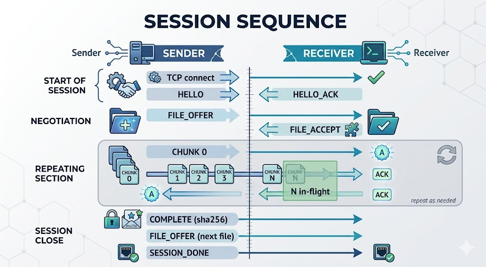

# filetrans

Direct file transfer between two machines. No cloud. No Wi-Fi required.

Works over USB-C cable, LAN, or any direct link — powered by the **GauravTransfer Protocol (GTP)**, a custom binary transport built for local-first transfers.

---

## Architecture

```
╔══════════════════════════════════════════════════════════════════════╗
║                          filetrans                                   ║
╠══════════════════════════════════════════════════════════════════════╣
║                                                                      ║
║   ┌─────────────────────────────────────────────────────────────┐   ║
║   │  Web GUI  (browser at localhost:7071)                        │   ║
║   │  • Drag & drop files/folders  • Any format  • Any size      │   ║
║   │  • Role selector (Sender / Receiver)                        │   ║
║   │  • Real-time progress bars                                  │   ║
║   └─────────────────────┬───────────────────────────────────────┘   ║
║                         │ HTTP / WebSocket                           ║
║   ┌─────────────────────▼───────────────────────────────────────┐   ║
║   │  Backend                                                     │   ║
║   │                                                              │   ║
║   │  ┌──────────────┐  ┌──────────────┐  ┌──────────────────┐  │   ║
║   │  │   detector   │  │  netconfig   │  │     config       │  │   ║
║   │  │  USB netlink │  │  ip addr /   │  │  flags → env →   │  │   ║
║   │  │  / polling   │  │  netsh       │  │  auto-detect     │  │   ║
║   │  └──────┬───────┘  └──────────────┘  └──────────────────┘  │   ║
║   │         │                                                    │   ║
║   │  ┌──────▼───────────────────────────────────────────────┐   │   ║
║   │  │           GauravTransfer Protocol (GTP/1.0)          │   │   ║
║   │  │                                                      │   │   ║
║   │  │  ┌────────────┐  ┌──────────┐  ┌─────────────────┐  │   │   ║
║   │  │  │  discovery │  │handshake │  │   sender /      │  │   │   ║
║   │  │  │  mDNS UDP  │  │HELLO neg.│  │   receiver      │  │   │   ║
║   │  │  │  multicast │  │caps/win  │  │   windowed      │  │   │   ║
║   │  │  └────────────┘  └──────────┘  │   chunks +      │  │   │   ║
║   │  │                                │   CRC32C + hash │  │   │   ║
║   │  │                                └─────────────────┘  │   │   ║
║   │  └──────────────────────────────────────────────────────┘   │   ║
║   └─────────────────────────────────────────────────────────────┘   ║
║                                                                      ║
╚══════════════════════════════════════════════════════════════════════╝

Physical transports:
  USB-C (RNDIS/CDC-ECM) ── LAN (Ethernet/Wi-Fi) ── Bluetooth PAN
  All treated identically by GTP — just a TCP socket.
```

---

## GauravTransfer Protocol (GTP/1.0)

Custom binary transport protocol — no HTTP, no WebSocket overhead on the data path.

```
Sender                                  Receiver
──────                                  ────────
TCP connect ──────────────────────────►
HELLO {version,role,caps,window} ─────►
                                        HELLO_ACK {caps,window} ◄──────
FILE_OFFER {name,size,chunks,hash} ───►
                                        FILE_ACCEPT {resume_chunk} ◄───
DATA {chunk 0} ───────────────────────►   ← windowed: N chunks in flight
DATA {chunk 1} ───────────────────────►
DATA {chunk 2} ───────────────────────►
                                        DATA_ACK {chunk 0, ok} ◄───────
                                        DATA_ACK {chunk 1, ok} ◄───────
                      ... continues until all chunks sent ...
COMPLETE {sha256} ────────────────────►
                                        COMPLETE_ACK {ok} ◄────────────
FILE_OFFER (next file) ───────────────► ← repeat per file
SESSION_DONE ─────────────────────────►
```

**Wire frame (9-byte header, little-endian):**
```
[GTP1][type:1B][payload_len:4B][payload: JSON or raw bytes]
```

**Peer discovery (mDNS, no config):**
```
UDP multicast 224.0.0.251:5354
Packet: "GTP1 1.0 <port> <device_id>"
Peers on same L2 segment find each other automatically.
```

Compare to WebRTC:

| WebRTC | GTP |
|--------|-----|
| ICE / STUN / TURN | mDNS multicast + USB detector |
| SDP (many round-trips) | HELLO/HELLO_ACK (one round-trip) |
| DTLS | Optional AES-256-GCM (GTP/2.0) |
| SCTP over UDP | Plain TCP (lower latency on local links) |
| RTP frames | GTP DATA frames (9B overhead, no base64) |
| Browser-only | Native Go — any OS, any app |

Full spec: [PROTOCOL.md](PROTOCOL.md)

---

## Install

### Linux

```bash
# Universal installer (detects distro + arch)
curl -fsSL https://raw.githubusercontent.com/gauravbhindwar/filetrans/main/scripts/install.sh | sh

# Arch Linux
curl -fsSL https://raw.githubusercontent.com/gauravbhindwar/filetrans/main/scripts/install-arch.sh | bash

# Manual — download binary from Releases, make executable
chmod +x filetrans_linux_amd64
sudo mv filetrans_linux_amd64 /usr/local/bin/filetrans
```

### Windows

Download `filetrans_windows_amd64.exe` (or `filetrans-gui_windows_amd64.exe`) from [Releases](../../releases).

No installer required — run directly from PowerShell.

### macOS

```bash
# Download from Releases, then:
chmod +x filetrans_darwin_arm64   # or amd64 for Intel
sudo mv filetrans_darwin_arm64 /usr/local/bin/filetrans

# Or use the .pkg installer from Releases (double-click to install)
```

---

## Run: GUI mode (recommended)

```bash
# Linux / macOS
filetrans-gui

# Windows
.\filetrans-gui_windows_amd64.exe
```

Opens browser at `http://localhost:7071` automatically.

1. **Connect USB-C cable** → GUI shows "USB link up" with detected IPs
   — or enter peer IP manually if using LAN / Wi-Fi
2. **Choose role**: Sender or Receiver (one side each)
3. **Sender**: drag & drop files/folders into the drop zone, or click "Native Dialog"
4. **Both sides**: click **Start Transfer**
5. Watch real-time progress. Done.

---

## Run: CLI mode

### USB-C transfer (Linux ↔ Windows)

**Linux side** (sender or receiver — set up USB gadget first):
```bash
# One-time USB gadget setup (run as root, resets on reboot)
sudo bash scripts/setup_gadget.sh

# Send files
sudo filetrans --role=sender photo.jpg video.mp4 documents/

# Receive files
sudo filetrans --role=receiver --download-dir=/home/user/received
```

**Windows side:**
```powershell
# Send files
.\filetrans.exe --role=sender photo.jpg

# Receive files
.\filetrans.exe --role=receiver --download-dir=C:\Users\User\Downloads\received
```

Both sides auto-detect the USB interface and IPs. No flags needed for basic use.

### LAN / Wi-Fi transfer (no USB)

```bash
# Receiver starts first
filetrans --role=receiver --no-usb

# Sender connects — scan LAN automatically
filetrans --role=sender --no-usb bigfile.iso

# Or specify peer IP directly (fastest)
filetrans --role=sender --peer=192.168.1.42 bigfile.iso
```

### Direct IP (guaranteed fastest, no discovery)

```bash
# Machine A (receiver)
filetrans --role=receiver --peer=192.168.1.100

# Machine B (sender)  
filetrans --role=sender --peer=192.168.1.200 file.zip
```

---

## USB-C setup by platform

### Linux → Windows (most common)

Linux acts as USB Ethernet gadget. Windows auto-installs RNDIS driver.

```bash
# Linux: enable gadget mode (requires kernel USB gadget support)
ls /sys/class/udc/
# If empty: your USB-C port is host-only → use LAN mode instead

sudo bash scripts/setup_gadget.sh
# Then run filetrans normally — it detects usb0/rndis0 automatically
```

**Windows RNDIS driver** (if not auto-installed):
```
Device Manager → right-click Unknown Device → Update Driver
→ Browse → Let me pick → Network Adapters
→ Microsoft → "Remote NDIS Compatible Device"
```

### Linux ↔ Linux

One side must support USB gadget mode:
```bash
# Gadget side
sudo bash scripts/setup_gadget.sh
filetrans --role=sender files/

# Host side (detects usb0 automatically)
filetrans --role=receiver
```

### macOS ↔ anything

macOS has no USB gadget mode. Use LAN mode:
```bash
filetrans --no-usb --role=sender file.zip
```

### Windows ↔ Windows

No USB gadget support on either side. Use LAN mode:
```powershell
filetrans.exe --no-usb --role=receiver
filetrans.exe --no-usb --role=sender --peer=192.168.1.42 file.zip
```

---

## All flags

```
filetrans [flags] [files...]

  --role          sender | receiver | auto  (default: auto, prompts if USB detected)
  --peer          Peer IP — skip detection, connect directly
  --no-usb        Skip USB detection, go straight to LAN/manual mode
  --port          Transfer port (default: 0 = auto-detect free port)
  --ui-port       GUI port (default: 0 = auto-detect)
  --linux-ip      Linux side IP (default: auto-detected from interfaces)
  --windows-ip    Windows side IP (default: auto-detected from interfaces)
  --subnet        Subnet prefix length (default: 24)
  --chunk-size    Bytes per chunk (default: 4 MiB)
  --download-dir  Receive directory (default: ~/Downloads/filetrans)
  --json-logs     Emit JSON log lines (for log aggregation)
  --log-level     debug | info | warn | error (default: info)
  --version       Print version and exit

Environment variables (same as flags, prefix FILETRANS_):
  FILETRANS_PORT, FILETRANS_PEER, FILETRANS_ROLE,
  FILETRANS_LINUX_IP, FILETRANS_WINDOWS_IP,
  FILETRANS_DOWNLOAD_DIR, FILETRANS_CHUNK_SIZE, ...
```

---

## Build from source

Requires Go 1.22+. No CGO. No external tools.

```bash
git clone https://github.com/gauravbhindwar/filetrans
cd filetrans
go mod download

# Build for current platform
go build -o filetrans ./cmd/filetrans
go build -o filetrans-gui ./cmd/filetrans-gui

# Cross-compile all platforms
make all

# Specific targets
make linux          # linux/amd64
make linux-arm      # linux/arm64
make windows        # windows/amd64
make darwin         # darwin/arm64 (Apple Silicon)
```

---

## Codebase

```
filetrans/
├── cmd/
│   ├── filetrans/          CLI entry point
│   └── filetrans-gui/      GUI entry point (opens browser)
├── backend/
│   ├── gtp/                GauravTransfer Protocol
│   │   ├── frame.go        Wire framing (magic, type, length-prefix)
│   │   ├── messages.go     Protocol message structs
│   │   ├── conn.go         TCP connection wrapper, windowed I/O
│   │   ├── handshake.go    HELLO negotiation, Listen/Connect
│   │   ├── sender.go       Windowed chunk sender
│   │   ├── receiver.go     Chunk receiver, CRC32C verify, resume
│   │   └── discovery/      mDNS peer discovery (no config needed)
│   ├── config/             Flags → env vars → auto-detect defaults
│   ├── detector/           USB interface watcher (netlink/polling)
│   ├── netconfig/          Static IP assignment (ip addr / netsh)
│   ├── transfer/           Legacy WebSocket transfer (kept for compat)
│   ├── handshake/          Legacy WebSocket handshake
│   ├── protocol/           Legacy wire message types
│   ├── fallback/           LAN TCP scanner (backup discovery)
│   ├── webui/              Web GUI server + API handlers
│   ├── logger/             Structured JSON logger
│   └── ui/                 Terminal prompts, progress bar
├── scripts/
│   ├── setup_gadget.sh     Linux USB gadget (configfs) setup
│   ├── install.sh          Universal Linux/macOS installer
│   ├── install-arch.sh     Arch Linux installer
│   └── package-macos.sh    macOS DMG + PKG builder
├── packaging/              nfpm config, AppImage, PKGBUILD
├── PROTOCOL.md             GTP/1.0 full specification
└── Makefile
```

---

## Hardware compatibility

| Setup | Works | Notes |
|-------|-------|-------|
| Linux ↔ Windows, USB-C | ✅ | Linux needs gadget mode (`g_ether`) |
| Linux ↔ Linux, USB-C | ✅ | One side needs gadget mode |
| Any two machines, LAN | ✅ | `--no-usb` or `--peer=<ip>` |
| macOS ↔ anything, LAN | ✅ | No gadget mode on macOS |
| Windows ↔ Windows, USB-C | ❌ | Neither side supports gadget mode |
| Raspberry Pi ↔ laptop | ✅ | Pi has gadget mode via OTG port |

---

## License

GPL-3.0 — see [LICENSE](LICENSE).

Created by Gaurav with ❤️
